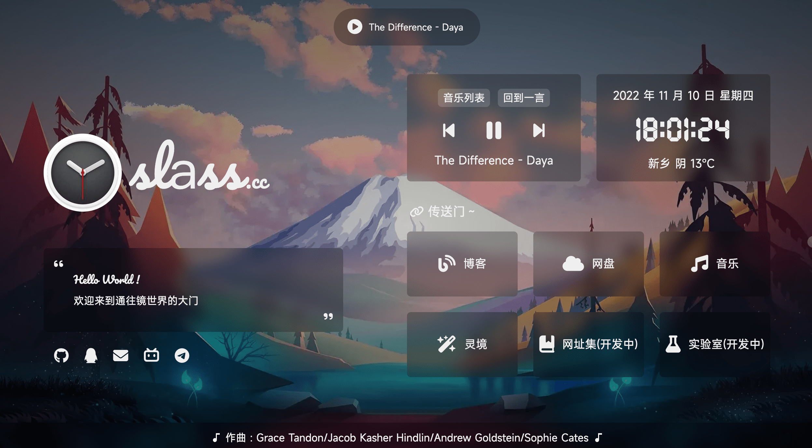

# 棱镜门 网站引导页


一款非常好看的个人网站引导页

## 搭建教程

[点击我！！！！](https://a.slass.cc/archives/homeweb)

### 功能

- [x] 载入动画
- [x] 站点简介
- [x] Hitokoto 一言
- [x] 日期及时间
- [x] 实时天气
- [x] 时光进度条
- [x] 音乐播放器
- [x] 移动端适配

* [ ] 去除 jQuery 依赖
* [ ] VUE 重构

### 天气

由于原天气 API 不稳定，已更换天气 API，现需要前往以下网站获取 key

- 前往 [ROLL](https://www.mxnzp.com/doc/list) 获取 app_id 和 app_secret，用于获取城市信息
- 前往 [和风天气](https://dev.qweather.com/) 获取 key，用于获取天气信息

也可自行更换其他方式

<!-- ### 配置

本项目采用 `json` 文件来配置站点内容，该配置不受版本更新影响，可将自定义配置写入 `setting.json` 以更改页面内容

<details>
<summary>配置说明</summary>

```json
{
    "title": "网页标题",
    "description": "网页简短介绍",
    "keywords": "网页关键词",
    "author": "网页作者",
    "logo_img": "Logo图片路径",
    "logo_text_1": "域名前缀",
    "logo_text_2": "域名后缀",
    "des_title": [
        "Hello World !", //站点介绍标题
        "一个建立于 21 世纪的小站，存活于互联网的边缘" //站点介绍内容
    ],
    "des_title_change": [
        "Oops !", //站点介绍标题点击后文字
        "哎呀，这都被你发现了 ( 再点击一次可关闭 )" //站点介绍内容点击后文字
    ],
    "github": "", //Github 用户名
    "qq": "", //QQ
    "email": "", //Email电子邮件
    "telegram": "", //Telegram 用户名
    "twitter": "", //Twitter用户名
    "weather_api": "https://www.yiketianqi.com", //天气 API
    "link_1": [
        "/", //链接地址
        "fa-solid fa-blog", //图标类名
        "博客" //链接文字
    ],
    "link_2": [
        "",
        "fa-solid fa-cloud",
        "网盘"
    ],
    "wallpaper_api": [
        [
            "每日一图", //壁纸设置项名称
            "https://api.dujin.org/bing/1920.php" //壁纸图片链接
        ]
    ],
    "Copyright_year": "2020", //站点起始年份
    "Copyright_text": "" //版权
}
```

</details> -->

### 音乐

>本项目采用了基于 `MetingJS` 的 `Aplayer` 音乐播放器，可实现快速自定义歌单  
>*仅支持 **中国大陆地区**，其他区域请将 [以下内容](https://file.imsyy.top/js/music/music-other.js) 替换 `music.js` 以实现音乐播放器的正常使用

更改 `music.js` 的参数即可实现自定义歌单列表

```js
let server = "netease"; //netease: 网易云音乐; tencent: QQ音乐; kugou: 酷狗音乐; xiami: 虾米; kuwo: 酷我
let type = "playlist"; //song: 单曲; playlist: 歌单; album: 唱片
let id = ""; //封面 ID / 单曲 ID / 歌单 ID
```

> 推荐我的网易云音乐，一起听歌吧～
> https://y.music.163.com/m/user?id=133241206&dlt=0846&app_version=8.8.70

### 字体
>由于本项目引入了中文字体，需要压缩中文字体以提高网页加载速度（ 也可以取消使用中文字体 ）

#### 中文字体去除繁体

- 安装 `Python 3.7` 和 `pip`
- 运行 `pip install fonttools`
- 下载 [sc_unicode.txt](https://gist.githubusercontent.com/imaegoo/d64e5088b723c2e02c40985f55ff12db/raw/5ebd2ce49418c73459a9dfe050483409306a6c1d/sc_unicode.txt)
- 运行 `pyftsubset 字体名称.ttf --unicodes-file=sc_unicode.txt`

#### 字体进一步压缩

- 编译安装 `Google woff2`

```bash
sudo apt-get install -y git g++ make
git clone --recursive https://github.com/google/woff2.git
cd woff2
make clean all
```

- 再压缩字体

```
./woff2_compress ./字体名称.ttf
```

- 最终可对原字体进行缓加载，**先行加载压缩后的字体**

>详细信息可前往 [虹墨空间站](https://www.imaegoo.com/2020/chinese-font-compress/) 查看原文

### 插件

* [Bootstrap](https://getbootstrap.com/)
* [iziToast](https://izitoast.marcelodolza.com/)
* [Font Awesome](https://fontawesome.com/)
* [jQuery](https://jquery.com/)
* [Aplayer](https://aplayer.js.org/)

### API

* [MetingAPI By 武恩赐](https://api.wuenci.com/meting/api/)
* [小歪 API](https://api.ixiaowai.cn/)
* [和风天气](https://dev.qweather.com/)
* [ROLL](https://www.mxnzp.com/doc/list)
* [Hitokoto 一言](https://hitokoto.cn/)

<a title="SSL" target="_blank" href="https://myssl.com/seal/detail?domain=blog.imsyy.top"></a>&nbsp;<a title="CDN" target="_blank" href="https://cdnjs.com/"></a>&nbsp;<a title="Copyright" target="_blank" href="https://imsyy.top/"></a>


## 🌟 Stargazers over time

[](https://starchart.cc/poshoi/homeweb)
 

fork：https://github.com/imsyy/home